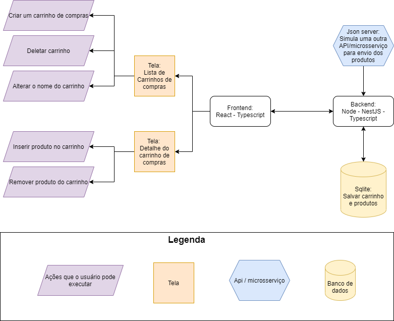

# Projeto Teste: Shopping List Manager

## Sobre o projeto
Este é um projeto onde um usuário pode criar listas de compras e cadastrar produtos na lista, além das quantidades de cada produto, podendo também visualizar o valor total a ser pago durante o processo.
O projeto é separado em 3 componentes:
* Front-end: Feito em React, Typescript, Styled-Components.
* Back-end: Feito em Node, Typescript, NestJS, TypeORM, Jest.
* Microsserviço: Um arquivo json utilizando o pacote Json-Server para servir os dados simulando uma API.

Resumidamente, tudo que o Front-end consome, ele requisita pelo backend principal, e este é o responsável por buscar dados tanto do banco de dados, quanto da API externa.
Quanto ao Back-end, a listagem de produtos vem da API externa, porém a criação de uma lista de compras e o registro de produtos dentro da lista é persistida em um banco de dados SQLite. A escolha do banco foi meramente pela simplicidade de não exigir instalaçoes e configurações complexas, porém ainda oferecendo grande parte dos recursos de bancos de dados relacionais mais comuns (como Postgres ou MySQL).

Segue um diagrama que ilustra os componentes e interações do projeto:



## Instruções para configuração e funcionamento das aplicações

Antes de iniciar cada projeto, é necessário criar os arquivos .env com as variáveis e seus valores preenchidos. Cada projeto tem um .env.example (menos a API do Json-Server) e caso não queira alterar os valores de cada variável, ele funcionará com os exemplos deixados.

Outro passo importante também é instalar os pacotes necessários de cada projeto. Para isso, basta utilizar um dos seguintes comandos, usando o gerenciador de pacote de sua preferência:
```
  yarn
  OU
  npm install
```

### Json-Server API

Para rodar este projeto, depois de instalado as dependências, basta executar o comando:
```
  yarn start
  OU
  npm start
```
E o servidor iniciará, configurado para receber requisições na porta 3333. Caso queira utilizar outra, basta alterar o script no package.json, porém não se esqueça de alterar as variáveis de ambiente do Back-end!

### Back-end

Além dos passos gerais descritos no início dessa sessão, é importante também conferir o arquivo ```ormconfig.json```. As configurações que estão lá já devem funcionar, mas caso queira utilizar outras, basta alterar as variáveis desejadas.
Recomendamos para rodar o projeto, que seja utilizado o comando:
```
  yarn start:dev
  OU
  npm run start:dev
```
Neste comando, deixamos um script onde o NestJS faz a build do projeto, cria o arquivo de banco de dados e já executa as Migrations, criando as tabelas necessárias para a persistência dos dados. Finalizado, ele iniciará o servidor, ficando pronto para receber as requisições.

### Front-end

Para o Front-end não há configurações adicionais, basta rodar:
```
  yarn start
  OU
  npm start
```

## Resumo dos endpoints no Back-end

Aqui pretendo listar os endpoints criados e o funcionamento deles.

* ``` GET /products ```: Retorna todos os produtos e suas categorias da API externa, organizados no seguinte formato:

```
[
  {
    "id": <number>,
    "categoriesId": <number>,
    "categoryName": <string>,
    "name": <string>,
    "price": <number>
  },
]
```

* ``` POST /shoppingList ```: Este endpoint tem a capacidade de criar ou alterar uma lista de compras. Ele aceita no corpo da requisição o seguinte formato:
```
{
  "id?": <number>,
  "name": <string>,
  "description?": <string>,
  "totalPrice?": <number>,
  "products": [
    {
      "id?": <number>,
      "shoppingListId": <number>,
      "productId": <number>,
      "quantity": <number>
    }
  ]
}
```

Os tipos sucedidos por uma exclamação apontam que o campo é opcional. Para criar uma lista nova de compras, basta não enviar o campo 'id' na requisição. Porém, caso queira alterar alguma informação de uma lista em específico, basta enviar o 'id' preenchido da lista a qual se deseja alterar.

* ``` GET /shoppingList ```: Este endpoint retorna as principais informações de todas as listas de compras já cadasrtadas no sistema. Um exemplo de retorno seria:
```
[
  {
    "id": 1,
    "name": "Compra de casa",
    "description": "Itens para ter na casa",
    "totalPrice": 100.23
  },
  {
    "id": 3,
    "name": "Escritório",
    "description": "Lista de compras para o escritório",
    "totalPrice": 86.91
  }
]
```

* ``` GET /shoppingList/:id ```: Retorna a lista de compras detalhada de uma lista com o id especificado na requisição. O retorno seria nesse formato:
```
{
  "id": 1,
  "name": "Compra de casa",
  "description": "Itens para ter na casa",
  "totalPrice": 7.98,
  "products": [
    {
      "id": 1,
      "shoppingListId": 1,
      "productId": 1,
      "quantity": 2,
      "name": "Tomate 1kg",
      "price": 3.99,
      "categoriesId": 1,
      "categoryName": "Hortifruti"
    }
  ]
}
```

* ``` DELETE /shoppingList/:id ```: Deleta do banco a lista de compras cujo id foi requisitado. Este processo não possui retorno.

## Testes Unitários

Foram desenvolvidos apenas testes unitários neste exercício, e todos eles apenas no Back-end da aplicação. Porém foram testados todos os métodos dos arquivos de service, que é onde ficam as regras de negócio da aplicação. São testados não apenas os cenários de sucesso, como também os de falha. Para rodar os testes, basta executar o comando:
```
  yarn test
  OU
  npm run test
```